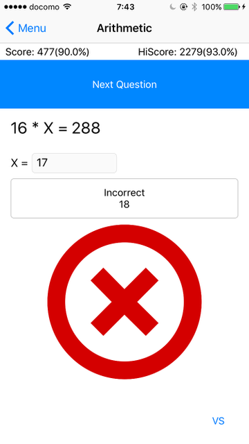

# Arithmetic Drill

## Description

This is a arithmetic drill app for from element school children to elder. Let's train your brain. And this app can against with someone. For example, play with the parents for a betting favourite meal, TV program. I am happay if this app helps a family's communication or learning for children.

X position randomly changes each question. Is this similar to KUMON? I do not know KUMON.

## Implementation

- [x] Swift 3 で作り直し
- [x] 表紙、本編、設定、何かの四画面構成
- [x] 得点、設定、正解率を保存
- [X] 得点時の視聴覚効果
- [ ] 画面デザイン見直し
- [ ] 遊び要素入れたい
- [ ] 得点ランキング
- [x] 対戦
- [x] バーストモード
- [x] レベル設定
- [x] 待ち時間なしモード
- [X] 九九モード
- [x] 独自キーボード
- [x] サイレントモード時はバイブレーション
- [x] 継続モード
- [ ] 説明書ページの作成

### About level

| Level | Numeric Number | Mathematic Symbol |
|------:|:---------------|:-----------------:|
| 1  | 1-9   | +-  |
| 2  | 1-15  | +-  |
| 3  | 1-15  | +-* |
| 4  | 1-20  | +-* |
| 5  | 5-20  | +-* |
| 6  | 5-25  | +-* |
| 7  | 5-40  | +-* |
| 8  | 5-50  | +-* |
| 9  | 5-60  | +-* |
| 10 | 10-60 | +-* |

## License

The MIT License (MIT)
Copyright (c) 2016 tkumata

Permission is hereby granted, free of charge, to any person obtaining a copy of this software and associated documentation files (the "Software"), to deal in the Software without restriction, including without limitation the rights to use, copy, modify, merge, publish, distribute, sublicense, and/or sell copies of the Software, and to permit persons to whom the Software is furnished to do so, subject to the following conditions:

The above copyright notice and this permission notice shall be included in all copies or substantial portions of the Software.

THE SOFTWARE IS PROVIDED "AS IS", WITHOUT WARRANTY OF ANY KIND, EXPRESS OR IMPLIED, INCLUDING BUT NOT LIMITED TO THE WARRANTIES OF MERCHANTABILITY, FITNESS FOR A PARTICULAR PURPOSE AND NONINFRINGEMENT. IN NO EVENT SHALL THE AUTHORS OR COPYRIGHT HOLDERS BE LIABLE FOR ANY CLAIM, DAMAGES OR OTHER LIABILITY, WHETHER IN AN ACTION OF CONTRACT, TORT OR OTHERWISE, ARISING FROM, OUT OF OR IN CONNECTION WITH THE SOFTWARE OR THE USE OR OTHER DEALINGS IN THE SOFTWARE.
