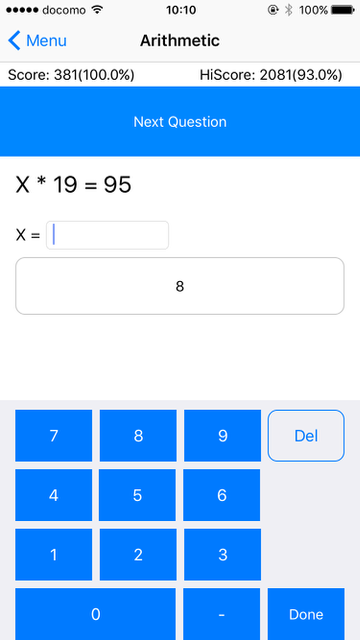

# Arithmetic Drill

## Description

This is a arithmetic drill app for from element school children to elder.

## Implementation

- [x] Swift 3 で作り直し
- [x] 表紙、本編、設定、説明書の四画面構成
- [x] 得点、設定、正解率を保存
- [ ] 得点の視聴覚効果
- [ ] 画面デザイン見直し
- [ ] 遊び要素入れたい
- [ ] 得点ランキング
- [ ] 対戦
- [x] バーストモード
- [x] レベル設定
- [x] 待ち時間なしモード
- [ ] 九九モード
- [x] 独自キーボード <- NEW!!!

## License

MIT

## Author

tkumata
